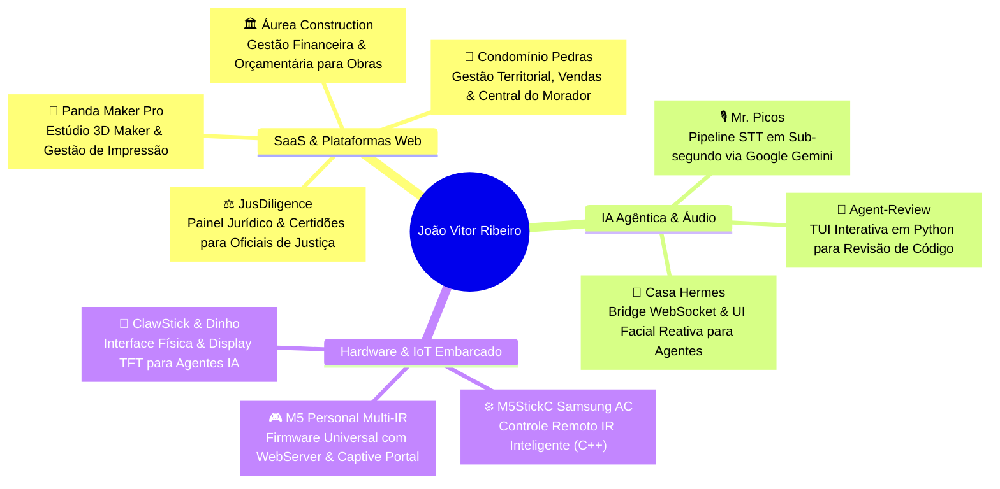

### **Software Engineer • Agentic AI Architect • Embedded & IoT Developer**

 

  

---

## 👨‍💻 Sobre Mim

Desenvolvedor focado em **engenharia de software robusta, arquiteturas agênticas e sistemas de alta confiabilidade**. Minha atuação abrange desde o desenvolvimento de SaaS full-stack e microsserviços de missão crítica até interfaces de IA em tempo real e firmware em C++ para microcontroladores (ESP32/M5Stack).

- 🏗️ **Sistemas & SaaS**: Arquitetura monolítica modular, microsserviços, integridade transacional (*fail-closed*), conciliação financeira e esteiras de dados geoespaciais.
- 🧠 **IA Agêntica & Voz**: Integração de LLMs multimodais (Google Gemini, OpenAI), STT em tempo real de baixa latência, frameworks autônomos e sistemas de code review.
- ⚡ **Hardware & IoT**: Protocolos de infravermelho de baixo nível (Samsung, Midea, Coolix), displays TFT SPI (ILI9341), WebServers embarcados e pontes físicas para agentes de IA.

---

## 🚀 Ecossistema de Projetos em Destaque

---

## 🛠️ Stacks & Tecnologias

### 🌐 Backend & Arquitetura

### 🎨 Frontend & Mobile

### 🗄️ Bancos de Dados, Cache & Infra

### ⚡ Hardware, IoT & Embarcados

---

## 📊 Estatísticas & Atividade GitHub

 

  

---

## 🐍 Gráfico de Contribuições

  

---

## 📬 Conecte-se Comigo

&nbsp;&nbsp;

  

